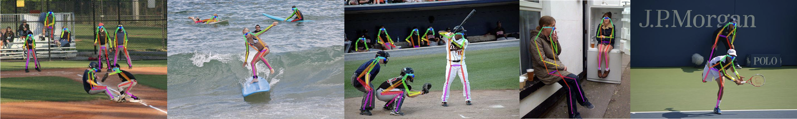

# fitness_helper一个肥宅也能跟上的健身/做操助手

## 0. 前言

作为一名卑微的肥宅（本人）或健身新人，你是否有遇到过：

- 好不容易鼓起勇气健身，却发现那些“暴瘦”视频**没一个跟得上**？
- 为了赶上视频不适合自己的速度拼尽全力，结果**动作全部走形，直接白干**？

没关系，我们可以用PP-TinyPose搭一个**会“等肥宅”的健身助手**（其实就是一个播放器），话不多说，看效果：

以打太极为例，我是一个手脚不协调的运动白痴，他会等我把动作摆对才会继续。

<iframe src="//player.bilibili.com/player.html?aid=429584233&bvid=BV1ke4y1i7uF" scrolling="no" border="0" frameborder="no" framespacing="0" allowfullscreen="true"  width="100%" height="560px"> </iframe>


当然不仅仅是太极，你也可以方便的**导入自己喜欢的视频**，然后让程序监督你成为视频中的猛男


## 1. 快速开始

### 1.1 环境配置

依赖都写在了requirements中，一行命令就能帮你装好。

```shell
pip install -r requirements.txt
```

### 1.2 解析视频

直接运行`video_preprocessing.py`

处理好的视频与json文件会统一保存在`video`文件夹下，方便之后调用

### 1.3 启动主程序

直接运行`main.py`就行。


## 2. 技术实现

### 2.1 骨骼关键点识别算法

使用PP-TinyPose完成了骨骼关键点的识别，图片来自PP-TinyPose项目页面



[PP-TinyPose Github链接](https://github.com/PaddlePaddle/PaddleDetection/tree/release/2.5/configs/keypoint/tiny_pose)

### 2.2 姿态比对

使用了很简单的方法，先过滤眼鼻等与健身关系不大的骨骼点数据，之后根据人的检出框进行归一化，然后用余弦距离计算相似度。

```python
camera_res = None
therhold = 0.97
video_KPT = skel_list[peo_area.index(max(peo_area))]
video_box = peo_boxes[peo_area.index(max(peo_area))]
while camera_res is None:
    try:
        camera_res = json.load(open("temp.json", "r"))
        except:
            pass
        camera_KPT = camera_res[2][0][0]
        camera_box = camera_res[1][0]
        # camera_KPT = skel_list[peo_area.index(min(peo_area))]
        video_vec = np.array(video_KPT)[5:17, 0:2]
        camera_vec = np.array(camera_KPT)[5:17, 0:2]
        for i in range(len(video_vec)):
            video_vec[i][0] = (video_vec[i][0]-video_box[0])/(video_box[2] - video_box[0])
            video_vec[i][1] = (video_vec[i][1] - video_box[1]) / (video_box[3] - video_box[1])
            camera_vec[i][0] = (camera_vec[i][0] - camera_box[0]) / (camera_box[2] - camera_box[0])
            camera_vec[i][1] = (camera_vec[i][1] - camera_box[1]) / (camera_box[3] - camera_box[1])
            video_vec = video_vec.reshape(-1)
            camera_vec = camera_vec.reshape(-1)
            cos_sim = video_vec.dot(camera_vec) / (np.linalg.norm(video_vec) * np.linalg.norm(camera_vec))
```


## 3. 未来工作

- 正在开发windows前端，未来也可能开发安卓与ios前端，尽量做成简单易用的傻瓜软件
- 视频多人场景下骨骼点检测比较混乱，不方便后续处理，以后尝试优化多人场景
- 相似度比较算法比较简单，效果可用，考虑以后换用更准确的评价方式
- 可能部署到intel AIbox上